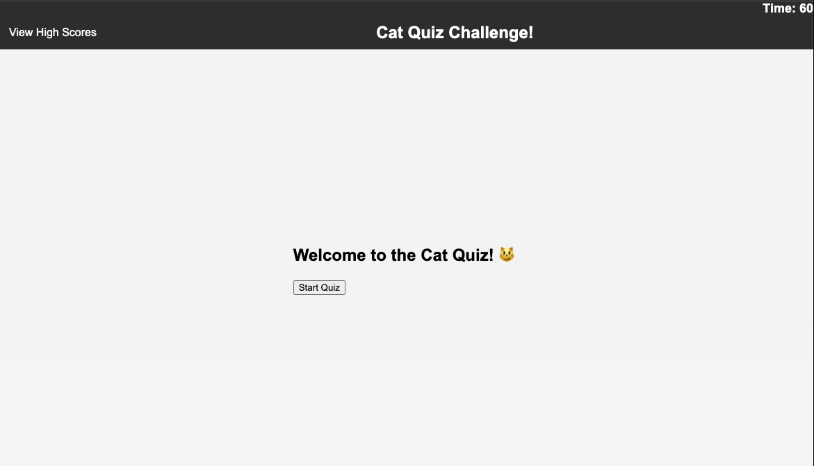

# Cat Quiz

## Technology Used 

| Technology Used         | Resource URL           | 
| ------------- |:-------------:| 
| HTML    | [https://developer.mozilla.org/en-US/docs/Web/HTML](https://developer.mozilla.org/en-US/docs/Web/HTML) | 
| CSS     | [https://developer.mozilla.org/en-US/docs/Web/CSS](https://developer.mozilla.org/en-US/docs/Web/CSS)      |   
| Javascript | [https://developer.mozilla.org/en-US/docs/Web/JavaScript](https://developer.mozilla.org/en-US/docs/Web/JavaScript)     |    

## Description 

The Cat Quiz App is a fun and interactive web application that tests your knowledge about cats! Put your feline facts to the test by answering a series of questions related to cats. With a user-friendly interface and engaging quiz experience, this app is perfect for cat enthusiasts of all ages.


## Deployed Site

[Deployed Site](https://rossfahan.github.io/cat-quiz/)

## Landing page



## How to Use

1. Click the "Start Quiz" button to begin the quiz.
2. Answer the quiz questions by selecting the correct option.
3. Your final score will be displayed at the end of the quiz.
4. Enter your initials to save your score to the high scores list.
5. Click "View High Scores" to see how your score ranks against others.

Enjoy the quiz and happy quizzing! 🐱🐾

## Author Info
### Links

```md
* [LinkedIn](https://www.linkedin.com/in/rossfahan)
* [Github](https://github.com/RossFahan)
```


## Credits

Referenced the following:
* [W3schools](https://www.w3schools.com/)
* [Mozilla Developer Network (MDN)](https://developer.mozilla.org/)
* [StackOverflow](https://stackoverflow.com)

## License

MIT License

Copyright (c) [2023] [Ross Fahan]

Permission is hereby granted, free of charge, to any person obtaining a copy
of this software and associated documentation files (the "Software"), to deal
in the Software without restriction, including without limitation the rights
to use, copy, modify, merge, publish, distribute, sublicense, and/or sell
copies of the Software, and to permit persons to whom the Software is
furnished to do so, subject to the following conditions:

The above copyright notice and this permission notice shall be included in all
copies or substantial portions of the Software.

THE SOFTWARE IS PROVIDED "AS IS", WITHOUT WARRANTY OF ANY KIND, EXPRESS OR
IMPLIED, INCLUDING BUT NOT LIMITED TO THE WARRANTIES OF MERCHANTABILITY,
FITNESS FOR A PARTICULAR PURPOSE AND NONINFRINGEMENT. IN NO EVENT SHALL THE
AUTHORS OR COPYRIGHT HOLDERS BE LIABLE FOR ANY CLAIM, DAMAGES OR OTHER
LIABILITY, WHETHER IN AN ACTION OF CONTRACT, TORT OR OTHERWISE, ARISING FROM,
OUT OF OR IN CONNECTION WITH THE SOFTWARE OR THE USE OR OTHER DEALINGS IN THE
SOFTWARE.